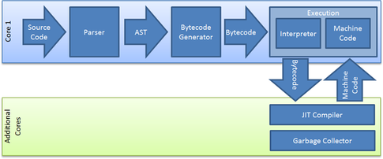
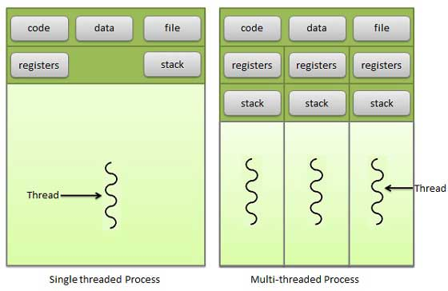

# Node.js - Aula 01 - Exercício
**user:** [sergiokopplin](https://github.com/sergiokopplin)
**autor:** Sergio Kopplin
**date:** 1454730409490

## Explique como um processo síncrono e assíncrono roda no Node.js, dê um exemplo para cada.

Um processo síncrono em node.js consiste em executar uma função e esperar o seu fim para que desse modo o sistema possa continuar a execução de outras funções. Por exemplo:

```JS
var fs = require('fs');
var contents = fs.readFileSync('/etc/passwd').toString();
console.log(contents);
```

Nesse primeiro exemplo, apenas quando a função **readFileSync** for terminada ele executará o **console** que vem em seguida, executando ambos de forma **síncrona**.

A grande diferença entre ambos é de que o processo assíncrono pode ocorrer e o sistema continuará a executar outros processos distintos, de forma **assíncrona**, impedindo assim que o seu funcionamento sofra uma parada na execução.

```JS
var fs = require('fs');
fs.readFile('/etc/passwd', function(err, buf) {
  console.log(buf.toString());
});
```

No nosso último exemplo, o javascript executará o **console** enquanto ele lê o arquivo através da função **readFile**, executando os dois ao mesmo tempo, de forma **assíncrona**.

ref: [daveeddy.com](http://www.daveeddy.com/2013/03/26/synchronous-file-io-in-nodejs/)


## Como o V8 executa JavaScript? Demonstre 1 exemplo com código ou imagem.

O v8 é um tipo de "Máquina Virtual". O objetivo do v8 é compilar a linguagem JS escrita pelo desenvolvedor para uma linguagem otimizada que o browser entenda ou que seja embarcada em uma aplicação.

No core fo v8 temos dois compiladores diferentes. "Full-codegen" que compila com mais velocidade e produz código sem otimização e o "Crankshaft" que demora mais em sua compilação mas produz código otimizado.



Na nossa imagem de exemplo temos uma pequena ideia de como uma engina JS funciona. Seguindo esses passos a engine consegue compilar o código e devolver algo que o navegador ou aplicação consegue interpretar.

Durante a compilação, a engine utiliza o C++ para conversão do código necessário.

ref: [quora.com](https://www.quora.com/How-does-a-JavaScript-engine-work)
ref: [thibaultlaurens.github.io](http://thibaultlaurens.github.io/javascript/2013/04/29/how-the-v8-engine-works/)

## Qual a diferença entre um sistema single para um multi-thread?



Na nossa imagem de exemplo podemos visualizar as "Single Threaded Process" e as "Multi-threaded Process". Basicamente, um sistema que utiliza o processamento de modo "Single" consegue executar um processo de modo único, indo de passo em passo até o final de sua execução. No caso do "Multi" o sistema pode sim executar mais de uma função ao mesmo tempo sem que isso afete cada processo individualmente, podendo então gerenciar o processamento de modo a atender a todos os processos necessários e atingir o resultado satisfatório para todos os processos.

## Como a Thread Pool tem um tamanho padrão de 4, o que acontece se você enviar 5 requisições ao banco?

Caso a thread pool receba processos além de sua capacidade, os em questão entrarão em uma fila de espera até que possam ser executados.

## Como você venderia o peixe do Node.js na sua empresa para tentar convencer seu chefe da sua adoção?

O node.js é uma linguagem atual e quem crescido muito. A motivação principal se dá quando pensamos em velocidade e performance, mas também podemos pensar nas apis disponíveis e em como a linguagem pode ser escalada e alterada com facilidade.

O nodejs tem se apresentado firme em sua utilização, e o casos de uso disponíveis na internet são mais que suficientes para saber que a linguagem é sim, poderosa e estável, e não uma linguagem passageira que não tem a força necessária para se perpetuar definitivamente.

## Qual a versão do seu `node`?
```sh
$ node -v
v5.5.0
```

## Qual a versão do seu `npm`?
```sh
$ npm -v
3.5.3
```
