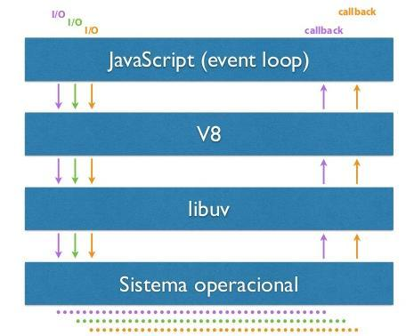

# Node.js - Aula 01 - Exercício
**user:** [viniciusmazzeo](https://github.com/viniciusmazzeo)
**autor:** Vinicius Moreira Mazzeo
**date:** 

## Explique como um processo síncrono e assíncrono roda no Node.js, dê um exemplo para cada.

Processos síncronos funcionam de forma sincronizada, há uma ordem definida, um processo novo só pode ser executando após o atual ser terminando.
Como exemplo uma fila de banco com apenas um caixa, você tem uma fila de clientes e eles são atendidos apenas um por vez, o próximo cliente só é atendido quando o atendimento do atual cliente terminar. 

**síncrono**

```js

function a(){
    console.log("a");
}
function b(){
    console.log("b");
}

a();
b();

```
As funções serão executadas em ordem, primeiro a, depois b.


Já um processo assíncrono não precisa esperar a sua vez para ser executado ele já é executando sem esperar o atual terminar, gerando um ganho de desempenho da aplicação.
Com o mesmo exemplo do banco, um processo assíncrono funciona da seguinte forma, ao chegar no banco as pessoas retiram senhas em um ordem mas como neste banco possui vários caixas apenas podem ser atendidas simultaneamente, ela não precisa esperar o atendimento anterior terminar pois já é possível ser atendida ao mesmo tempo. 

**assíncrono**

```js

function a(){
    console.log("Assíncrono aqui");
}
function b(){
    setTimeout(a, 0);
    console.log("b");
}
b();

```
O resultado sera

b
Assíncrono aqui


## Como o V8 executa JavaScript? Demonstre 1 exemplo com código ou imagem.

O V8 foi feito em C++ ele é um interpretador de JavaScript, com o V8 podemos executar o JavaScript no servidor.
Ele recebe o código JavaScript, compila esse código para um código nativo de máquina assim podendo executá-lo.
Fazendo uma comparação o V8 seria como um Vitual Machine do Java, graças a ele conseguimos executar nosso script feito em JS no servidor. 



## Qual a diferença entre um sistema single para um multi-thread?

Single thread ele gera apenas uma processo gerenciando este únicos processo, com isso gera uma economia de processamento de memória, os sistemas multi-thred gera uma nova thered para casa processo, para cada requisição, com isso acaba gerando um consumo de memória e processamento maior. 

## Como a Thread Pool tem um tamanho padrão de 4, o que acontece se você enviar 5 requisições ao banco?

Caso seja feita 5 requisições, a quinta fica aguardando o término de uma das requisições para assim entrar na thread pool.

## Como você venderia o peixe do Node.js na sua empresa para tentar convencer seu chefe da sua adoção?

Mostraria que os custos seriam reduzido, pois o node é assíncrono com isso reduziria o consumo de memória e processamento automaticamente reduzindo custos.
Mostraria a melhora de desempenho que o Node poderia trazer.
Por possuir muitas bibliotecas opensource e a cada dia surge uma nova, assim reduzindo custos com softwares de terceiros.
A aplicação seria desenvolvida em JavaScript uma linguagem difundida no mercado.

## Qual a versão do seu `node`?

```js

~$ node -v
v6.2.2

```

## Qual a versão do seu `npm`?

```js

~$ npm -v
3.9.5

```