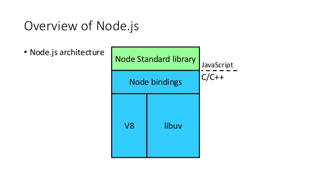

# Node.js - Aula 01 - Exercício
**user:** [xereda](https://github.com/xereda)
**autor:** Jackson Ricardo Schroeder
**date:** 1464838528755

## Explique como um processo síncrono e assíncrono roda no Node.js, dê um exemplo para cada.

Um processo **síncrono** sofre execução linear e logicamente sequencial, sendo que a próxima iteração somente é executada após a efetiva conclusão da rotina anterior. Trazendo para o mundo real, é como se fossemos levar nossos filhos ao colégio e após deixá-los, no lugar de continuarmos com nossa vida normal, ficassemos os esperando até a aula terminar, lá parados, durante 4 longas horas. Estariamos adotando um processo síncrono de levar e buscar nossos filhos. Durante esse intervalo, nada mais por nós seria feito.

### Exemplo de execução síncrona usando o nodeJS:

```js

// criamos um arquivo com o nome "sincrono.js" e com a seguinte estrutura interna
var fs = require("fs");
var data = fs.readFileSync('/tmp/exemplo.txt');
console.log(data.toString());
console.log("Encerrado!");

// depois no console do sistema operacional,
// executamos o node passando como parametro o script "sincrono.js" criado acima
node sincrono.js
Este eh o conteudo do arquivo txt.
Encerrado!

```
_Você pode observar que o javascript aguardou o leitura do arquivo, depois a conversão para string e somente após esses dois processos ele foi para a próxima iteração que é a impressão, no console, do texto `"Encerrado!"`._


Já uma rotina **assíncrona** é enviada para o _Event Loop_ do NodeJS e o script principal segue sendo executado normalmente. Reutilizando o exemplo no mundo real citado acima, com um processo assíncrono, deixamos nossos filhos no colégio, mas continuamos com nossa vida normal, como por exemplo, indo trabalhar. Durante as 4 horas que nossos filhos estão na escola, podemos realizar outras atividades, preocupando-nos em buscá-los somente no horário de encerramento das aulas.

### Exemplo de execução assíncrona usando o nodeJS:


EX:

```js

// criamos outro arquivo, agora chamado de "assincrono.js", com as seguintes linhas internas
var fs = require("fs");
fs.readFile('exemplo.txt', function (err, data) {
    if (err) return console.error(err);
    console.log(data.toString());
});
console.log("Encerrado!");

// agora executamos o node passando como parâmetro este novo script
node assincrono.js
Encerrado!
Este eh o conteudo do arquivo txt.

```

_Observe que agora a string "Encerrado!" veio por primeiro, ignorando a execução pendente anterior. Isso ocorreu, pois executamos a função fs.readFile() de forma assíncrona. A leitura do arquivo exemplo.txt foi enviada para a fila Event Loop, mas a execução do próxima rotina, ou seja, a impressão da string "Encerrado!" foi muito mais rápida._


## Como o V8 executa JavaScript? Demonstre 1 exemplo com código ou imagem.

V8 é um motor javascript, desenvolvido pela Google e open source, de alta performance e escrito em linguagem C++. É o motor de javascript padrão do navegador Google Chrome. Ele implementa ECMAScript e pode ser executado nos sistema operacionais Windows, MAC OS X e em diferentes distribuições Linux. O V8 pode ser utilizado de forma independente ou ainda ser incorporado em aplicações C++.



## Qual a diferença entre um sistema single para um multi-thread?

Um sistema single thread, tem em suas rotinas, uma execução baseada em um único agente de processamento.

Já em sistemas multi thread, para cada requisição de processamento, um novo agenda é consumido para tal finalidade.

No caso do nodeJS, seu single thread é mantida baseando-se numa fila chamada "Event Loop" e esta tem como principal caracaterística ser non-blocking (sem bloqueio de execução) e assíncrona. Tanto o event loop como o tread pool são mantidos pela [Libuv](http://libuv.org/). **Libuv** é uma biblioteca com suporte a multi-platormas e com foco em I/O assíncrono.

## Como a Thread Pool tem um tamanho padrão de 4, o que acontece se você enviar 5 requisições ao banco?

Neste caso, a quinta requisição aguardará, na _Event Queue_ (fila de eventos da Libuv), até que uma das 4 requisições que estão consumindo as _Thread Pool_ disponíveis encerre sua rotina de execução. Embora, por padrão, o nodeJS defina 4 tread pools disponíveis, este número pode ser incrementado em até 128 threads (variável de ambiente UV_THREADPOOL_SIZE), inclusive em tempo de execução com o parâmetro `process.env.UV_THREADPOOL_SIZE`.

## Como você venderia o peixe do Node.js na sua empresa para tentar convencer seu chefe da sua adoção?

Inicialmente faria um comparativo entre o nodeJS e outros principais servidores de aplicação do mercado, enfatizando as vantagens de adoção. Ressaltaria suas principais caractéricas, como baixo consumo de recursos físicos e a fácil e ampla possibilidade de escalabilidade. Finalizaria citando as principais empresas que usam o nodeJS e focaria num case de sucesso, como por exemplo o caso do Paypal, ou ainda, o da NetFlix.

## Qual a versão do seu `node`?

```
xereda@macminixereda:~$ node -v
v6.2.0

```

## Qual a versão do seu `npm`?

```

xereda@macminixereda:~$ npm -v
3.8.9

```
