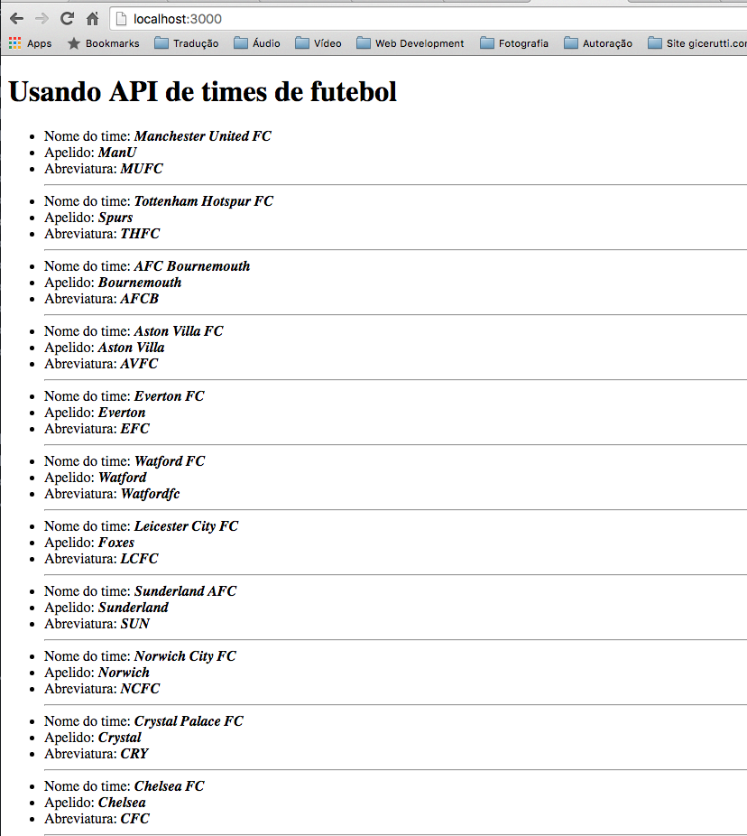

# Node.js - Aula 03 - Exercício
**user:** [xereda](https://github.com/xereda)
**autor:** Jackson Ricardo Schroeder
**date:** 1465274797795

## Por que quando requisitamos ao nosso servidor de *Query String*, **com o Chrome**, ele executa 2 requisições, sendo a última "*vazia*"?

Isso realmente ocorre apenas no Google Chrome. O Google Chrome realiza mais uma requisição, mas dessa vez para recuperar o favicon.ico, caso exista no servidor.


## Qual a DIFERENÇA entre o GET e o POST?

Embora o método POST também retorne informações para o requisitante, convencionou-se que POST _(inserir/Create)_ seria um método mais adequado para criar um novo documento, ficando para o GET o uso na recuperação das informações _(ler/Read/retrieve)_.

Já com base no **protocolo HTTP**, tecnicamente os dois métodos possuem algumas diferentes características. O método GET possui restrição de tamanho, e os parâmetros são repassados de forma explícita na requisição, num padrão URL (querystring). O método POST, tem suporte para envio de dados em maior volume e permite o envio de dados binários. Um exemplo de uso do método post são os formulários de upload de arquivos.


## Crie um Pokemon na nossa API com seu nome, depois modifique seu nome pelo seu User do Github.

**POST**

```js

// SCRIPT http-request-post.js
"use strict";

const http = require("http");

const options = {
  host: "webschool-io.herokuapp.com",
  method: "DELETE",
  path: "/api/pokemons/5756594a48075f1100eebd3b"
};

function callback(res) {

  console.log("STATUS: " + res.statusCode);
  console.log("HEADERS: " + JSON.stringify(res.headers));

  let data = "";

  res.setEncoding("utf8");
  res.on("data", (dados) => {

    data += dados;

  });

  res.on("end", () => {
    console.log("Dados Finalizados: " + data);
  });

}

const req = http.request(options, callback);

req.on("error", (e) => {
  console.log("ERROOOOO: " + e.message);
});

req.end();

```

```js

xereda@macminixereda:~/S/b/n/aula03$ node http-request-post.js
name=Jackson%20Ricardo%20Schroeder&type=aluno
STATUS: 201
HEADERS: {"server":"Cowboy","connection":"close","x-powered-by":"Express","access-control-allow-origin":"*","content-type":"application/json; charset=utf-8","content-length":"91","etag":"W/\"5b-+kVJUd6DgHh39yVynxbEtQ\"","date":"Tue, 07 Jun 2016 05:20:42 GMT","via":"1.1 vegur"}
Dados Finalizados: {"__v":0,"name":"Jackson Ricardo Schroeder","type":"aluno","_id":"575659aa48075f1100eebd3c"}

```

**PUT**

```js

"use strict";

const http = require("http");
const querystring = require("querystring");

const postData = querystring.stringify({
  name: "xereda",
  type: "aluno"
});

const options = {
  host: "webschool-io.herokuapp.com",
  method: "PUT",
  path: "/api/pokemons/575659aa48075f1100eebd3c",
  headers: {
    "Content-Type": "application/x-www-form-urlencoded",
    "Content-length": postData.length
  }
};

function callback(res) {

  console.log("STATUS: " + res.statusCode);
  console.log("HEADERS: " + JSON.stringify(res.headers));

  let data = "";

  res.setEncoding("utf8");
  res.on("data", (dados) => {

    data += dados;

  });

  res.on("end", () => {
    console.log("Dados Finalizados: " + data);
  });

}

const req = http.request(options, callback);

req.on("error", (e) => {
  console.log("ERROOOOO: " + e.message);
});

console.log(postData);

req.write(postData);
req.end();

```

```js

xereda@macminixereda:~/S/b/n/aula03$ node http-request-put.js
name=xereda&type=aluno
STATUS: 202
HEADERS: {"server":"Cowboy","connection":"close","x-powered-by":"Express","access-control-allow-origin":"*","content-type":"application/json; charset=utf-8","content-length":"108","etag":"W/\"6c-KXqz1ydQydNDOG0DgOGl5A\"","date":"Tue, 07 Jun 2016 05:26:39 GMT","via":"1.1 vegur"}
Dados Finalizados: {"data":{"ok":1,"nModified":1,"n":1,"lastOp":"6293317649279483905","electionId":"56ee12f2563048036a1e77e7"}}

```


## **Depois faça o DELETE**, criando o script para tal, colocando aqui a resposta.

```js

"use strict";

const http = require("http");

const options = {
  host: "webschool-io.herokuapp.com",
  method: "DELETE",
  path: "/api/pokemons/575659aa48075f1100eebd3c"
};

function callback(res) {

  console.log("STATUS: " + res.statusCode);
  console.log("HEADERS: " + JSON.stringify(res.headers));

  let data = "";

  res.setEncoding("utf8");
  res.on("data", (dados) => {

    data += dados;

  });

  res.on("end", () => {
    console.log("Dados Finalizados: " + data);
  });

}

const req = http.request(options, callback);

req.on("error", (e) => {
  console.log("ERROOOOO: " + e.message);
});


req.end();

```

```js

xereda@macminixereda:~/S/b/n/aula03$ node http-request-delete.js
STATUS: 204
HEADERS: {"server":"Cowboy","content-length":"0","connection":"close","x-powered-by":"Express","access-control-allow-origin":"*","date":"Tue, 07 Jun 2016 05:30:25 GMT","via":"1.1 vegur"}
Dados Finalizados:

```

## Escolha uma **API externa** e crie um script para fazer um GET nela **mostrando o resultado com HTML**.

```js

'use strict';

const http = require('http');

const app = {
    createServer: () => {
        this.server = http.createServer((req, response) => {
            response.writeHead(200, { 'Content-Type': 'text/html' });
            http.get(app.optionsRequest, res => {
                let data = '';

                res.on('data', chunck => data += chunck);

                res.on('end', () => {
                    var json = JSON.parse(data)
                        , html = app.htmlHelper.build(json);
                    response.write(html);
                    response.end();
                });
            });
        });
    },
    htmlHelper: {
        build: (data) => {
            var html = '';
            html += app.htmlHelper.buildHeader();
            html += app.htmlHelper.buildBody(data);
            html += app.htmlHelper.buildFooter();
            return html;
        },
        buildHeader: () => {
            var html = '<!doctype html>' +
                '<html>' +
                '<head>' +
                '<meta charset="utf-8">' +
                '</head>' +
                '<body>';
            return html;
        },
        buildBody: data => {
          var html = '<h1>Usando API de times de futebol</h1>';
              html += '<ul>';
              let x = 0;
              let clube = [];

              for(clube in data.teams) {
                //console.log("x eh: "  + x);
                html += '<li>Nome do time: <b><i>' + data.teams[clube].name + '</i></b></li>';
                html += '<li>Apelido: <b><i>' + data.teams[clube].shortName + '</i></b></li>';
                html += '<li>Abreviatura: <b><i>' + data.teams[clube].code + '</i></b></li>';
                html += '<hr>';

              }
              html += '</ul>';
          return html;
        },
        buildFooter: () =>{ return '</body></html>' }
    },
    optionsRequest: {
        hostname: 'api.football-data.org',
        path: '/v1/soccerseasons/398/teams',
        headers: {
          'X-Auth-Token': 'bb738b800597467f98bc52e6e6093b69'
        }
    },
    listen: () => this.server.listen(3000, () => console.log('Estou pronto!')),
    server: null
};


app.createServer();
app.listen();


```

**HTML**



```

<!doctype html><html><head><meta charset="utf-8"></head><body><h1>Usando API de times de futebol</h1><ul><li>Nome do time: <b><i>Manchester United FC</i></b></li><li>Apelido: <b><i>ManU</i></b></li><li>Abreviatura: <b><i>MUFC</i></b></li><hr><li>Nome do time: <b><i>Tottenham Hotspur FC</i></b></li><li>Apelido: <b><i>Spurs</i></b></li><li>Abreviatura: <b><i>THFC</i></b></li><hr><li>Nome do time: <b><i>AFC Bournemouth</i></b></li><li>Apelido: <b><i>Bournemouth</i></b></li><li>Abreviatura: <b><i>AFCB</i></b></li><hr><li>Nome do time: <b><i>Aston Villa FC</i></b></li><li>Apelido: <b><i>Aston Villa</i></b></li><li>Abreviatura: <b><i>AVFC</i></b></li><hr><li>Nome do time: <b><i>Everton FC</i></b></li><li>Apelido: <b><i>Everton</i></b></li><li>Abreviatura: <b><i>EFC</i></b></li><hr><li>Nome do time: <b><i>Watford FC</i></b></li><li>Apelido: <b><i>Watford</i></b></li><li>Abreviatura: <b><i>Watfordfc</i></b></li><hr><li>Nome do time: <b><i>Leicester City FC</i></b></li><li>Apelido: <b><i>Foxes</i></b></li><li>Abreviatura: <b><i>LCFC</i></b></li><hr><li>Nome do time: <b><i>Sunderland AFC</i></b></li><li>Apelido: <b><i>Sunderland</i></b></li><li>Abreviatura: <b><i>SUN</i></b></li><hr><li>Nome do time: <b><i>Norwich City FC</i></b></li><li>Apelido: <b><i>Norwich</i></b></li><li>Abreviatura: <b><i>NCFC</i></b></li><hr><li>Nome do time: <b><i>Crystal Palace FC</i></b></li><li>Apelido: <b><i>Crystal</i></b></li><li>Abreviatura: <b><i>CRY</i></b></li><hr><li>Nome do time: <b><i>Chelsea FC</i></b></li><li>Apelido: <b><i>Chelsea</i></b></li><li>Abreviatura: <b><i>CFC</i></b></li><hr><li>Nome do time: <b><i>Swansea City FC</i></b></li><li>Apelido: <b><i>Swans</i></b></li><li>Abreviatura: <b><i>SWA</i></b></li><hr><li>Nome do time: <b><i>Newcastle United FC</i></b></li><li>Apelido: <b><i>Newcastle</i></b></li><li>Abreviatura: <b><i>NUFC</i></b></li><hr><li>Nome do time: <b><i>Southampton FC</i></b></li><li>Apelido: <b><i>Southampton</i></b></li><li>Abreviatura: <b><i>SFC</i></b></li><hr><li>Nome do time: <b><i>Arsenal FC</i></b></li><li>Apelido: <b><i>Arsenal</i></b></li><li>Abreviatura: <b><i>AFC</i></b></li><hr><li>Nome do time: <b><i>West Ham United FC</i></b></li><li>Apelido: <b><i>West Ham</i></b></li><li>Abreviatura: <b><i>WHU</i></b></li><hr><li>Nome do time: <b><i>Stoke City FC</i></b></li><li>Apelido: <b><i>Stoke</i></b></li><li>Abreviatura: <b><i>SCFC</i></b></li><hr><li>Nome do time: <b><i>Liverpool FC</i></b></li><li>Apelido: <b><i>Liverpool</i></b></li><li>Abreviatura: <b><i>LFC</i></b></li><hr><li>Nome do time: <b><i>West Bromwich Albion FC</i></b></li><li>Apelido: <b><i>West Bromwich</i></b></li><li>Abreviatura: <b><i>WBA</i></b></li><hr><li>Nome do time: <b><i>Manchester City FC</i></b></li><li>Apelido: <b><i>ManCity</i></b></li><li>Abreviatura: <b><i>MCFC</i></b></li><hr></ul></body></html>

```
